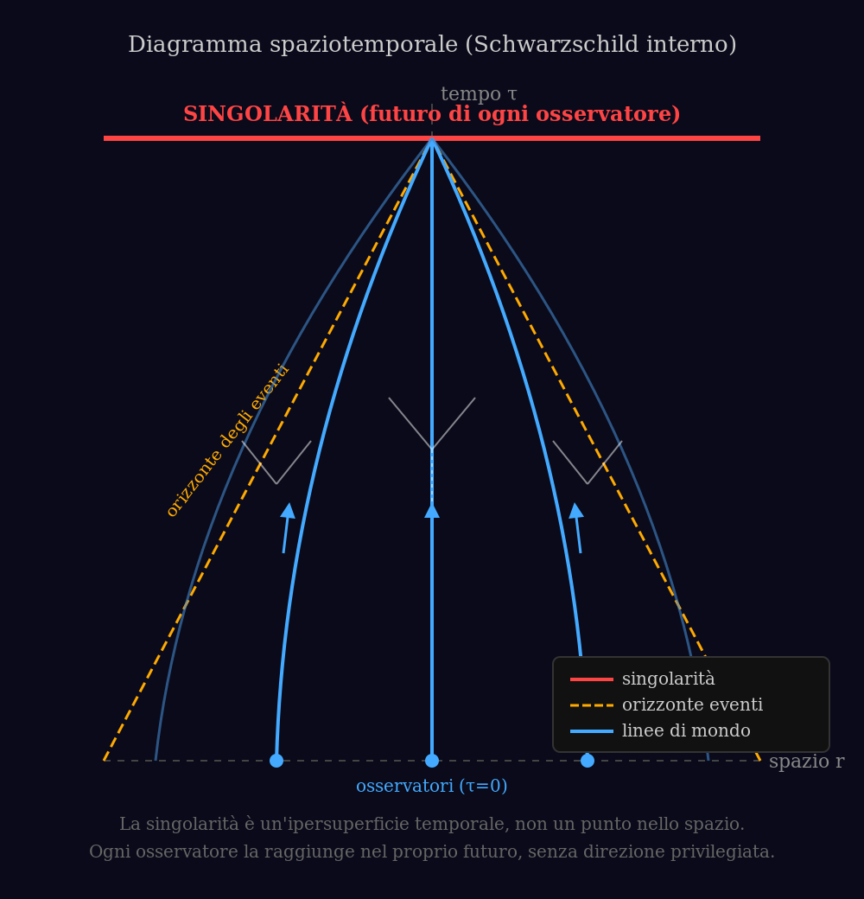
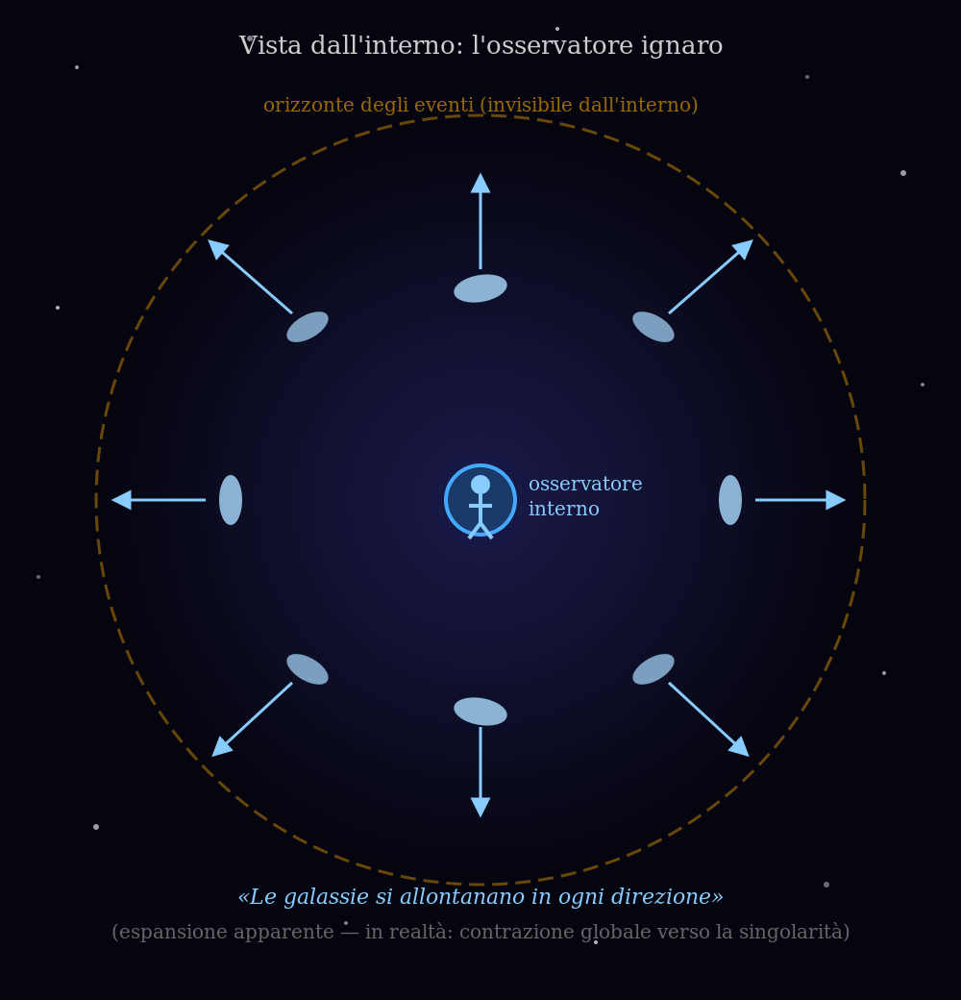
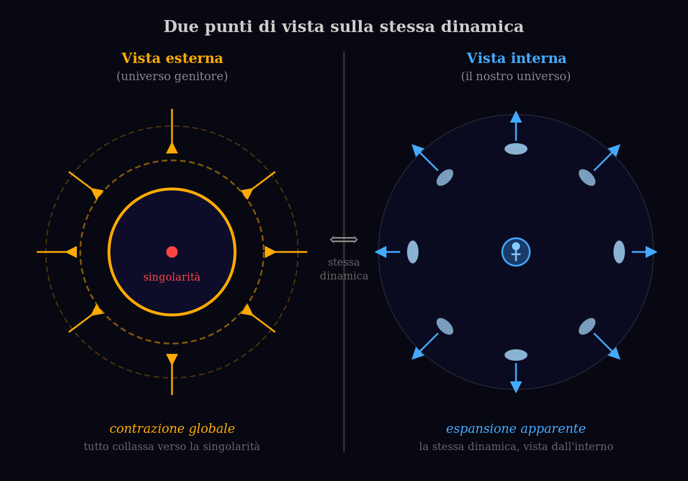

# Contrazione Asintotica Frenata
## Un'ipotesi interpretativa: la gravità come possibile effetto locale di una caduta cosmica eterna all'interno di un buco nero

**Progetto:** Contrazione-Asintotica-Frenata  
**Autore:** Isidoro Ghezzi  
**Data:** 5 giugno 2026

---

## Riassunto

Si esplora qui, in via speculativa, un modello interpretativo in cui il nostro universo osservabile corrisponde all'interno di un buco nero formatosi in un universo genitore. Quella che interpretiamo come espansione cosmica è l'effetto apparente di una contrazione globale verso la singolarità. Grazie al principio di equivalenza e a una dilatazione temporale crescente, questa contrazione è asintotica e frenata: ci avviciniamo alla singolarità ma non la raggiungiamo mai. La gravità terrestre, le orbite dei satelliti e le maree emergono come effetti locali e differenziali di questa unica dinamica. Il modello unifica relatività generale, principio di equivalenza e aspetti della selezione naturale cosmica di Lee Smolin senza richiedere necessariamente nuova fisica quantistica.

---

## Diagrammi

| Diagramma spaziotemporale | Vista dell'osservatore interno | Schema comparativo |
|:---:|:---:|:---:|
|  |  |  |

---

## 1. Introduzione

Il modello standard descrive un universo in espansione accelerata, ma lascia aperti molti interrogativi sull'origine del Big Bang, sulla taratura fine delle costanti e sulla natura dell'energia oscura.

Partendo dal principio di equivalenza e dalla geometria interna dei buchi neri, si sviluppa qui una visione alternativa: il nostro universo è l'interno di un buco nero. Dal punto di vista esterno tutto collassa; dal nostro punto di vista interno questo collasso appare come espansione, mentre la contrazione globale frenata genera la gravità quotidiana.

---

## 2. Il Modello di Base (Contrazione Asintotica Frenata)

- Nella metrica di Schwarzschild interna, le coordinate temporali e radiali si scambiano.
- Tutta la materia, lo spazio e noi stessi partecipiamo a una caduta collettiva verso la singolarità.
- Il principio di equivalenza rende questa caduta accelerata indistinguibile da un campo gravitazionale locale.

---

## 3. La Frenatura Temporale e l'Asintoticità

La caratteristica centrale del modello è la dilatazione temporale crescente legata alla contrazione:

Man mano che ci avviciniamo alla singolarità, la dilatazione temporale cresce: visti dall'esterno, i secondi interni diventano progressivamente più lunghi. Il parametro interno (coordinata radiale effettiva $r(\tau)$) tende a zero solo per $\tau \to \infty$. Dal nostro punto di vista interno, il tempo scorre normalmente — ma non raggiungiamo mai la singolarità.

**Conseguenza:** la singolarità non viene mai raggiunta. La contrazione è frenata in modo naturale dalla relatività generale, rendendo il processo eterno dal nostro sistema di riferimento senza bisogno di rimbalzi quantistici.

---

## 4. Implicazioni Locali

- **Gravità sulla Terra:** effetto della contrazione frenata su scala locale.
- **Satelliti in orbita:** caduta libera comune nella stessa contrazione globale, con velocità tangenziale che genera orbite stabili.
- **Maree:** effetto differenziale della contrazione (gradiente tra lato vicino e lontano della Luna).

---

## 5. Collegamenti con Altre Teorie

Il modello si inserisce nella linea di ricerca sulla cosmologia dei buchi neri (Gaztañaga, Popławski) e nella selezione naturale cosmica di Lee Smolin.

---

## 6. Punti di Forza e Questioni Aperte

### Punti di forza

- Unificazione elegante tra gravità locale e cosmologia.
- Risoluzione naturale del problema della singolarità.
- Compatibilità con il principio di equivalenza e con la relatività generale classica.
- **Assenza di un centro spaziale:** nella metrica di Schwarzschild interna, la singolarità non è un punto nello spazio ma un'ipersuperficie nel tempo — è nel futuro di ogni osservatore, non in una direzione privilegiata. La contrazione è quindi uniforme e priva di centro, esattamente come l'espansione nel modello del Big Bang. Questa proprietà è naturalmente compatibile con l'isotropia del fondo cosmico a microonde.
- **Espansione apparente e accelerazione cosmica:** la contrazione globale frenata, vista dall'interno, appare come espansione. La dilatazione temporale crescente fa sì che i secondi propri diventino progressivamente più lunghi. Questo rallentamento del tempo produce un effetto osservabile analogo all'espansione accelerata, senza bisogno di introdurre l'energia oscura.

### Questioni aperte

- Previsioni osservabili specifiche.

---

## 7. Conclusione

Viviamo all'interno di una grande contrazione asintotica frenata. La gravità che sentiamo è il segnale locale di questo processo cosmico unitario, mentre il rallentamento del tempo garantisce un futuro indefinito. Si tratta di un'ipotesi speculativa ma coerente, che merita ulteriore sviluppo.

---

**Parole chiave:** contrazione asintotica frenata, cosmologia dei buchi neri, principio di equivalenza, dilatazione temporale gravitazionale, selezione naturale cosmica.
